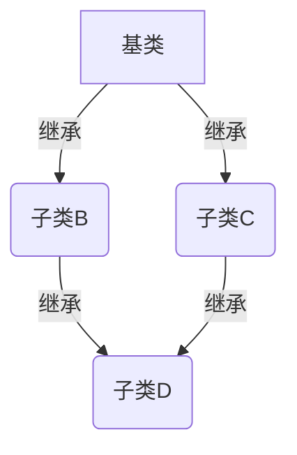
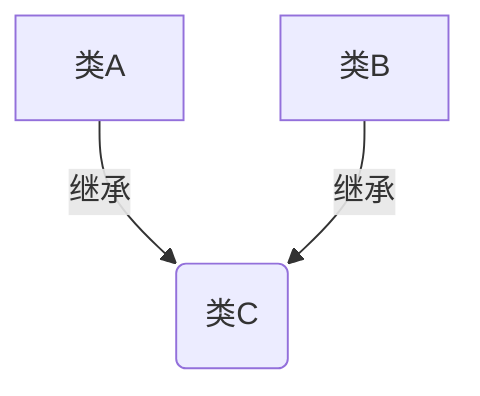
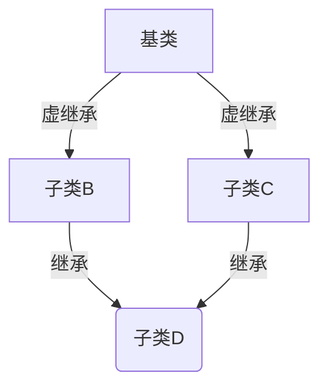

# 继承
***
  继承是面向对象编程中的一个非常重要的概念，它允许你用一个类 B 来获取另外一个类 A 的属性。A 类称为 **基类** B 类称为 **子类** 。
  
  继承思想很好的体现了程序设计中的 **开闭原则** 允许我们，在不对某块源码进行修改的情况下，进行新功能的添加和已有功能的完善。实现了**高内聚低耦合** 。
  
<!--more-->
*** 
## C++ 中继承的属性
***

C++ 中继承的属性分为:

- public
 - 类内和类外均可访问类内属性为 public 的成员变量
 - 继承时，子类继承所有属性为 public 的成员变量
- protected
 - 类外不可访问属性为 protected 的成员变量，类内可以访问
 - 继承时，子类继承所有属性为 public、protected 属性的成员变量
- private
 - 类外不可访问属性为 private 的成员变量，类内可以访问
 - 继承时，子类不继承属性为 private 的成员变量
 
     
总结:
   1. 在类外对类内的属性进行访问时，只可以访问属性为 public 的成员变量。
   **注意:** 当类外的某个函数被声明为类的友元的时候，可该友元函数可以不受访问权限的制约，访问类内所有的成员变量。 
   
   2. 当发生类的继承的时候，受到访问权限的制约，只能继承属性为 public、protected 的成员变量。
   
   
***
## 继承的问题
***

继承在复杂的情况下，会出现不可控的情况。例如菱形继承，菱形继承中会出现基类的变量，在每个继承的子类中各存在一份的情况。
造成了，无法共享实现类间共享数据、空间浪费等问题。

## 菱形继承

菱形继承的场景如下:

<center>

</center>

此时 B 类中存在着一份 A 类的变量，C 类中存在着一份 A 类的变量。两份 A 类的变量，各自独立，互不影响。
但是在底层类 D 中，进行调用顶层类 A 中的变量，会出现二义性错误

代码如下：

```C++
#include <iostream>

using namespace std;

class Animal
{
public:
    int eat;
    int sleep;
};

class Sheep : public Animal
{
public:
    int horn;
};

class Camel : public Animal
{
public:
    int hump;
};

class SheepCamel :public Sheep, public Camel
{
public:
    int fail;
};
```

在 vs 中查看类的模型如下:


可以很清楚的看到，上面的继承是一个菱形继承，导致了继承成员变量冲突的问题(二义性）。

**注意：** 虽然可以通过 **作用域解析运算符**，来指定在菱形继承中的底部类，要使用哪个菱形继承的中间类的变量，但是不推荐使用。
通过作用域运算符来指定调用对象的方法，见下面的多继承代码实现。

## 多继承

同时多继承也存在着类似菱形继承的问题：多继承中，A 类继承了 B 类，同时 A 类继承了 C 类 且 B 类和 C 类存在同名的成员变量，或方法。
那么在 A 类中对重名的元素进行调用时，会因为二义性导致出错。场景如下：

<center>

</center>

代码如下:
```C++
class Flyable
{
public:
	void fly()
	{
		cout << "飞..." << endl;
	}

	void sound()
	{
		cout << "biubiubiu" << endl;
	}
};

class Run
{
public:
	void run()
	{
		cout << "冲冲冲" << endl;
	}

	void sound()
	{
		cout << "biupubiupu" << endl;
	}
};

class SuperMan :public Flyable, public Run
{
};

// 多继承
void test01()
{
	SuperMan man;
	man.fly();
	man.Flyable::sound();

	// 报错，二义性（在继承的对象中，有多个同名的函数)
	//man.sound();
	man.run();
	man.Run::sound();
}
```

***
# 虚继承
***

为了解决上述的多继承和菱形继承中的问题，C++ 实现了一种新的继承方式：虚继承。
虚继承，解决了在从多个路径继承同一个类时出现的数据冗余，调用时出现的二义性，节省了内存开销。

***
## 虚继承原理
***

在从多个路径继承同一个基类的时候，每个不同的路径在继承时，都声明继承方式为虚继承， 那么在虚继承时，
各个子类内部保存的不是基类的数据的拷贝，而是一个 **指向基类的指针** 。在需要使用基类中的数据时，直接通过
指针来进行调用基类中的数据。

流程图如下：
<center>

</center>

此时在底层类 D 中再去对顶层类 A 中的成员进行调用，就可以避免了二义性，而且中间类 B、C 
均保存了一份指向顶层类 A 的指针，通过指针，而不是数据拷贝来使用顶层类 A 的数据。

代码如下:
```C++
class Aaa
{
public:
	Aaa()
	{
		cout << "A 的构造函数" << endl;
		m_a = 100;
	}

	~Aaa()
	{
		cout << "A 的析构函数" << endl;
	}

public:
	int m_a;
};

class Bbb :virtual public Aaa
{
public:
	Bbb()
	{
		cout << "B 的构造函数" << endl;
		m_b = 100;

		// 虚继承指向的是同一个 A
		m_a = 5;
	}

	~Bbb()
	{
		cout << "B 的析构函数" << endl;
	}

public:
	int m_b;
};

class Ccc :virtual public Aaa
{
public:
	int m_c;

public:
	Ccc()
	{
		cout << "C 的构造函数" << endl;
	}

	~Ccc()
	{
		cout << "C 的析构函数" << endl;
	}
};

class Ddd : public Bbb, public Ccc
{
public:
	int m_d;
public:
	Ddd()
	{
		cout << "D 的构造函数" << endl;
	}

	~Ddd()
	{
		cout << "D 的析构函数" << endl;
	}
};

// 菱形继承，会导致在底层的类中
// 出现多份顶层的类的成员
// 且每份顶层的类的成员各自独立
// 去调用时会有二义性
void test02()
{
	Ddd d;

	// 出现二义性调用错误
	//d.m_a;

	// 虚继承之后，则不会出现二义性
	d.m_a;
	cout << d.Ccc::m_a << endl;
}
```

# 总结
在继承时，通过虚继承方式，可以很好的规避在从多个路径继承同一个基类时，出现的数据冗余及在通过继承类调用基类中数据出现的二义性。
同时，类的继承是很好的实现开闭原则的方式。

